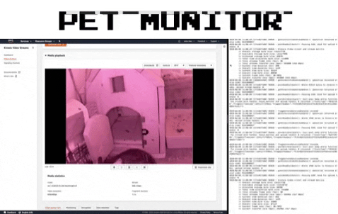

# pet-monitor
pet monitor by Raspberry Pi and AWS kinesis video stream



## Hardware

- Raspberry Pi (3 Model B or later, Zero W) 
- Raspberry Pi Camera (preferred infrared camera for certain pets)

## Cloud Service

- AWS Kinesis Video Stream
- AWS System Manager (Optional)

## Start

1. Using the C++ Producer SDK on Raspberry Pi
https://docs.aws.amazon.com/kinesisvideostreams/latest/dg/producersdk-cpp-rpi.html

```
mkdir -p amazon-kinesis-video-streams-producer-c/build; 
cd amazon-kinesis-video-streams-producer-c/build; 
cmake .. -DBUILD_GSTREAMER_PLUGIN=ON -DBUILD_JNI=TRUE
```

2. Install gstreamer1 
```
sudo apt-get install gstreamer1.0-tools
```

3. Start producer

```bash
$ gst-launch-1.0 v4l2src do-timestamp=TRUE device=/dev/video0 ! videoconvert ! video/x-raw,format=I420,width=640,height=480,framerate=30/1 ! omxh264enc control-rate=1 target-bitrate=5120000 periodicity-idr=45 inline-header=FALSE ! h264parse ! video/x-h264,stream-format=avc,alignment=au,width=640,height=480,framerate=30/1,profile=baseline ! kvssink stream-name="YourStreamName" access-key="YourAccessKey" secret-key="YourSecretKey" aws-region="YourAWSRegion"
```

https://docs.aws.amazon.com/kinesisvideostreams/latest/dg/examples-gstreamer-plugin.html

